<div align="center">

<!-- Logo Placeholder -->


# 🧠 Rag-n-React

**A powerful AI-powered conversation starter kit built with React & AWS Amplify**

<!-- Badges -->
[](https://choosealicense.com/licenses/mit/)
[](https://reactjs.org/)
[](https://www.typescriptlang.org/)
[](https://amplify.aws/)
[](https://aws.amazon.com/bedrock/)
[](https://vitejs.dev/)
[](https://pnpm.io/)

[](https://github.com/ityou-tech/rag-n-react)
[](https://eslint.org/)
[](https://vitejs.dev/)

---

*The most complete AI conversation starter kit with real-world examples*

[🚀 Quick Start](#-quick-start) • [📚 Documentation](#-project-structure) • [⚙️ Configuration](#%EF%B8%8F-configuration) • [🛠️ Development](#%EF%B8%8F-development)

</div>

## ✨ What is Rag-n-React?

**Rag-n-React** is a production-ready, comprehensive starter kit for building intelligent conversational AI applications. While the name suggests RAG (Retrieval-Augmented Generation), this starter kit currently focuses on powerful AI conversations with data integration - **RAG capabilities are planned and will be added soon** using [AWS Amplify's Knowledge Base integration](https://docs.amplify.aws/react/ai/conversation/knowledge-base/).

This is designed to be the **most complete and powerful starter kit** with real-world examples, production patterns, and enterprise-ready features.

Perfect for building:
- 💼 **Customer support chatbots** with access to your knowledge base  
- 📊 **Data query interfaces** that speak natural language  
- 🤖 **AI assistants** for internal tools and workflows
- 🔍 **Intelligent search** and discovery applications
- 🏢 **Enterprise AI solutions** with proper authentication and security

## 🏗️ Architecture & Tech Stack

```mermaid
graph TB
    A[React Frontend] --> B[AWS Amplify Gen 2]
    B --> C[Amazon Bedrock<br/>Nova Micro]
    B --> D[DynamoDB<br/>Data Layer]
    B --> E[Cognito Auth]
    
    C --> F[AI Conversations]
    D --> G[Customer Teams<br/>Real-world Data]
    F --> H[Context-Aware Responses]
    
    I[🔜 RAG Knowledge Base] -.-> C
    I -.-> J[🔜 Vector Search]
    
    style A fill:#61DAFB
    style B fill:#FF9900
    style C fill:#232F3E
    style D fill:#3F48CC
    style E fill:#DD344C
    style I fill:#FFA500,stroke-dasharray: 5 5
    style J fill:#FFA500,stroke-dasharray: 5 5
```

<div align="center">



</div>

| Layer | Technology | Purpose |
|-------|------------|---------|
| **Frontend** | React 19 + TypeScript + Vite | Modern, fast UI with type safety |
| **Backend** | AWS Amplify Gen 2 | Infrastructure as code, serverless |
| **AI Engine** | Amazon Bedrock (Nova Micro) | Large language model with cross-region support |
| **Database** | DynamoDB | Scalable NoSQL data storage with real examples |
| **Authentication** | Amazon Cognito | Secure user management with domain restrictions |
| **Build System** | Vite + ESBuild | Lightning-fast development and builds |
| **Package Manager** | pnpm | Efficient dependency management |
| **🔜 RAG Layer** | [Knowledge Base](https://docs.amplify.aws/react/ai/conversation/knowledge-base/) | Vector search & document retrieval *(coming soon)* |

## 🚀 Quick Start

### Prerequisites

- **Node.js** 18+ (recommended: 20+)
- **pnpm** package manager
- **AWS CLI** configured with appropriate permissions
- **AWS Account** with Bedrock access enabled

### 1️⃣ Clone & Install

```bash
git clone https://github.com/ityou-tech/rag-n-react.git
cd rag-n-react
pnpm install
```

### 2️⃣ Deploy Sandbox Environment

```bash
# Deploy AWS resources to sandbox environment
pnpm run deploy-sbx
```

**Important:** You need to manually update the ConversationHandler IAM policy **after your first deployment**. This is a temporary requirement until a permanent code-first solution is implemented. See [🌍 **Fix For ConversationHandler (One-Time After Deployment)**](#-fix-for-conversationhandler-one-time-after-deployment) for required policy configuration steps.

This creates your AWS infrastructure including:
- DynamoDB tables for data storage
- Cognito user pool for authentication  
- Bedrock AI conversation handlers
- Lambda functions for custom queries

### 3️⃣ Start Development Server

```bash
# Start local development server
pnpm run dev
```

Your app will be available at `http://localhost:5173` 🎉

### 4️⃣ (Optional) Seed Test Data

```bash
# First, ensure you have the required dependencies
cd dev_scripts
pnpm install @aws-sdk/client-dynamodb @faker-js/faker

# Get your DynamoDB table name from the Amplify outputs
# Look for CustomerTeam table name in your AWS console or amplify_outputs.json

# Seed with default 100 records
CUSTOMER_TEAM_TABLE_NAME=CustomerTeam-<your-table-suffix> node populateCustomerTeams.js

# Create specific number of records (e.g., 50)
CUSTOMER_TEAM_TABLE_NAME=CustomerTeam-<your-table-suffix> node populateCustomerTeams.js 50

# Clear existing data first, then create 100 new records
CUSTOMER_TEAM_TABLE_NAME=CustomerTeam-<your-table-suffix> node populateCustomerTeams.js 100 --clear
```

**Prerequisites for data seeding:**
- AWS credentials configured (`assume`, `aws configure`, or environment variables)
- Your actual DynamoDB table name (found in AWS Console)
- Required Node.js packages installed in the `dev_scripts` directory

**Usage examples:**
```bash
# Example with actual table name
CUSTOMER_TEAM_TABLE_NAME=CustomerTeam-ct2fqxniubax7jwnx6aegbpq2i-NONE node populateCustomerTeams.js 25
```

## 🎯 Core Features

### 💬 **Intelligent Conversations**
- Multi-turn conversations with persistent context
- Real-time message streaming from Amazon Bedrock
- Conversation history management (create, edit, delete)
- Mobile-responsive chat interface with collapsible sidebar

### 🔍 **Smart Data Querying**  
- Natural language queries against your DynamoDB data
- AI-powered data tools with automatic function calling
- **Real-world example**: Customer team management with rich filtering
- Real-time data counts and analytics
- Custom resolvers for complex business logic

### 🔐 **Enterprise Authentication**
- Configurable domain restrictions for team access
- AWS Cognito integration with secure sign-up flows
- Customizable authentication UI components
- Session management and automatic token refresh

### 📱 **Production-Ready UX/UI**
- Fully responsive design that works on all devices
- Collapsible sidebar for optimal screen usage
- Syntax highlighting for code responses with [`rehype-highlight`](package.json:25)
- Comprehensive loading states and error handling
- Professional theme with consistent design system

### 🛠️ **Developer Experience**
- **Complete TypeScript** setup with strict mode
- **ESLint configuration** with React best practices
- **Development scripts** for data seeding and testing
- **Hot module replacement** with Vite
- **Dependency management** with automated updates

## 🔮 Planned Features

### 🧠 **RAG Implementation (Coming Soon)**
We're actively working on adding full RAG capabilities using [AWS Amplify's Knowledge Base integration](https://docs.amplify.aws/react/ai/conversation/knowledge-base/):

- **Vector embeddings** for document search
- **Knowledge base integration** with S3 and OpenSearch
- **Document upload and processing** pipeline
- **Semantic search** across your content
- **Citation and source tracking** for AI responses

Stay tuned for updates! ⭐ Star this repo to get notified.

## 📂 Project Structure

```
rag-n-react/
├── 📁 amplify/                      # AWS Amplify Gen 2 backend infrastructure
│   ├── 📁 auth/                     # Authentication configuration
│   │   ├── resource.ts              # Cognito user pool setup with domain restrictions
│   │   └── 📁 pre-sign-up/          # Pre-signup Lambda function for domain validation
│   │       ├── handler.ts           # Domain restriction logic implementation
│   │       └── resource.ts          # Lambda function configuration
│   ├── 📁 data/                     # Data layer and AI conversation setup
│   │   ├── resource.ts              # DynamoDB schema, AI tools, and Bedrock integration
│   │   └── scanTeam.js              # Custom Lambda resolver for team data counting
│   ├── backend.ts                   # Main Amplify backend configuration entry point
│   ├── package.json                 # Backend dependencies for Lambda functions
│   ├── package-lock.json            # Lock file for backend dependencies
│   └── tsconfig.json                # TypeScript config for backend code
├── 📁 src/                          # React frontend application source code
│   ├── 📁 components/               # Reusable React UI components
│   │   ├── AuthenticatorWrapper.tsx # Custom Amplify authenticator with styling
│   │   ├── AuthHeader.tsx           # Header component with user authentication controls
│   │   └── 📁 chat/                 # Complete chat interface implementation
│   │       ├── ChatView.tsx         # Main chat component with message handling
│   │       ├── ConversationLayout.tsx # Layout wrapper for chat interface
│   │       ├── ConversationSidebar.tsx # Sidebar for conversation history management
│   │       ├── ReasoningDisplay.tsx # Component for displaying AI reasoning steps
│   │       ├── ResponseComponents.tsx # Message rendering with syntax highlighting
│   │       ├── TeamInfoCard.tsx     # Card component for displaying team data
│   │       └── WelcomeScreen.tsx    # Initial welcome screen with feature overview
│   ├── 📁 hooks/                    # Custom React hooks for state management
│   │   └── useConversations.tsx     # Hook for managing conversation CRUD operations
│   ├── 📁 styles/                   # CSS styling and theme configuration
│   │   └── code-highlighting.css    # Syntax highlighting styles for code blocks
│   ├── 📁 utils/                    # Utility functions and helpers
│   │   └── messageParser.ts         # Message parsing and formatting utilities
│   ├── 📁 assets/                   # Static assets and images
│   │   └── react.svg                # React logo for UI
│   ├── App.css                      # Global application styles
│   ├── App.tsx                      # Root React component with routing and providers
│   ├── client.tsx                   # Amplify client configuration and initialization
│   ├── constants.ts                 # Application constants and theme configuration
│   ├── index.css                    # Global CSS reset and base styles
│   ├── main.tsx                     # React application entry point and mounting
│   ├── types.ts                     # TypeScript type definitions for the app
│   └── vite-env.d.ts                # Vite environment type declarations
├── 📁 dev_scripts/                  # Development and testing utilities
│   ├── populateCustomerTeams.js     # Script for seeding DynamoDB with sample data
│   └── README.md                    # Documentation for development scripts
├── 📁 public/                       # Static public assets served by Vite
│   └── vite.svg                     # Vite logo for favicon
├── 📄 .gitignore                    # Git ignore patterns for the project
├── 📄 amplify.yml                   # Amplify build specification (overrides console settings)
├── 📄 amplify.yml.bak               # Backup of original build specification
├── 📄 CODE_OF_CONDUCT.md            # Community code of conduct guidelines
├── 📄 CONTRIBUTING.md               # Guidelines for project contributions
├── 📄 eslint.config.js              # ESLint configuration for code quality
├── 📄 index.html                    # Main HTML template for single-page app
├── 📄 LICENSE                       # MIT license for the project
├── 📄 package.json                  # Frontend dependencies, scripts, and metadata
├── 📄 pnpm-lock.yaml                # Lock file for exact dependency versions
├── 📄 README.md                     # This comprehensive project documentation
├── 📄 tsconfig.json                 # TypeScript configuration for frontend
├── 📄 tsconfig.node.json            # TypeScript configuration for Node.js tooling
└── 📄 vite.config.ts                # Vite build tool configuration and plugins
```

### 🎯 Key File Categories

| Category | Files | Purpose |
|----------|-------|---------|
| **🏗️ Infrastructure** | [`amplify/`](amplify/) | Complete AWS backend setup with IaC |
| **🎨 Frontend Core** | [`src/App.tsx`](src/App.tsx), [`src/client.tsx`](src/client.tsx) | React app foundation and AWS integration |
| **💬 Chat System** | [`src/components/chat/`](src/components/chat/) | Complete conversational AI interface |
| **🔧 Development** | [`dev_scripts/`](dev_scripts/), [`eslint.config.js`](eslint.config.js) | Development tools and code quality |
| **📦 Configuration** | [`package.json`](package.json), [`vite.config.ts`](vite.config.ts), [`amplify.yml`](amplify.yml) | Build system and dependency management |

## ⚙️ Configuration

### 🎨 **Customizing the AI Assistant**

Edit [`amplify/data/resource.ts`](amplify/data/resource.ts) to modify:

- **AI Model**: Change from Nova Micro to other Bedrock models
- **System Prompt**: Customize the assistant's personality and instructions  
- **Tools**: Add new data tools or external API integrations
- **Cross-region Setup**: Configure for your preferred AWS regions

### 🔐 **Authentication Settings**

Modify [`amplify/auth/pre-sign-up/resource.ts`](amplify/auth/pre-sign-up/resource.ts):

```typescript
environment: {
  ALLOW_DOMAIN: 'yourcompany.com'  // Change to your domain
}
```

Or remove domain restrictions entirely by commenting out the pre-sign-up trigger.

### 🏗️ **Build Configuration**

The root [`amplify.yml`](amplify.yml) takes **precedence** over Amplify's console buildspec:

```yaml
backend:
  phases:
    build:
      commands:
        - npm install -g pnpm          # Uses pnpm for faster installs
        - pnpm install --frozen-lockfile
        - npx ampx pipeline-deploy --branch $AWS_BRANCH --app-id $AWS_APP_ID

frontend:
  phases:
    build:
      commands:
        - pnpm run build              # Builds with Vite
  artifacts:
    baseDirectory: dist
    files:
      - '**/*'
```

## 🛠️ Development

### 📜 **Available Scripts**

| Command | Description |
|---------|-------------|
| `pnpm run dev` | Start development server with hot reload |
| `pnpm run build` | Build for production (TypeScript + Vite) |
| `pnpm run preview` | Preview production build locally |
| `pnpm run lint` | Run ESLint for code quality |
| `pnpm run deploy-sbx` | Deploy to AWS sandbox environment |
| `pnpm run update-deps` | Update all dependencies to latest versions |

### 🧪 **Development Workflow**

1. **Local Development**: Use `pnpm run dev` for fast development with hot module replacement
2. **Sandbox Testing**: Deploy with `pnpm run deploy-sbx` to test AWS integrations  
3. **Data Seeding**: Run `dev_scripts/populateCustomerTeams.js` for realistic test data
4. **Code Quality**: Always run `pnpm run lint` before committing
5. **Production**: Deploy through Amplify console or CI/CD pipeline

### 🔧 **Adding New Features**

**Want to add a new data model?**
1. Define schema in [`amplify/data/resource.ts`](amplify/data/resource.ts)
2. Add AI tools for querying your new data
3. Create React components to display results
4. Update system prompt to handle new queries

**Need external API integration?**
1. Add custom resolvers in the `amplify/data/` directory
2. Configure AI tools to call your resolvers
3. Handle API responses in your React components

**Ready to add RAG capabilities?**
Follow the [AWS Amplify Knowledge Base guide](https://docs.amplify.aws/react/ai/conversation/knowledge-base/) to integrate vector search and document retrieval.

## 🚀 Deployment

### Sandbox Deployment
```bash
pnpm run deploy-sbx
```

### Production Deployment
1. Connect your repository to AWS Amplify Console
2. Amplify will automatically use the [`amplify.yml`](amplify.yml) buildspec
3. Configure environment variables in Amplify Console
4. Deploy with automatic CI/CD on git push

### 🌍 **Fix For ConversationHandler (One-Time After Deployment)**

**⚠️ IMPORTANT**: For the ConversationHandler to work, you need to manually update the IAM policy **after your first deployment**. This is a temporary requirement until a permanent code-first solution is implemented.

#### Required Steps:

1. **Deploy your application first** using the standard deployment process
2. **Go to AWS Console** → IAM → Roles
3. **Find the conversation handler role**:
   - Look for: `amplify-ragnreact-<yourname>-ChatDefaultConversationHa-<someid>`
   - Example: `amplify-ragnreact-main-ChatDefaultConversationHa-ABCD1234`
4. **Click on the role** → Permissions tab → Find the inline policy
5. **Edit the inline policy** and add the following statement:

```json
{
    "Version": "2012-10-17",
    "Statement": [
        {
            "Effect": "Allow",
            "Action": [
                "bedrock:InvokeModel",
                "bedrock:InvokeModelWithResponseStream"
            ],
            "Resource": [
                "arn:aws:bedrock:eu-central-1:YOUR_ACCOUNT_ID:inference-profile/eu.amazon.nova-micro-v1:0"
            ]
        },
        {
            "Effect": "Allow",
            "Action": [
                "bedrock:InvokeModel",
                "bedrock:InvokeModelWithResponseStream"
            ],
            "Resource": [
                "arn:aws:bedrock:eu-north-1::foundation-model/amazon.nova-micro-v1:0",
                "arn:aws:bedrock:eu-west-1::foundation-model/amazon.nova-micro-v1:0",
                "arn:aws:bedrock:eu-west-3::foundation-model/amazon.nova-micro-v1:0",
                "arn:aws:bedrock:eu-central-1::foundation-model/amazon.nova-micro-v1:0"
            ],
            "Condition": {
                "StringLike": {
                    "bedrock:InferenceProfileArn": "arn:aws:bedrock:eu-central-1:YOUR_ACCOUNT_ID:inference-profile/eu.amazon.nova-micro-v1:0"
                }
            }
        }
    ]
}
```

#### Important Notes:
- **Replace `YOUR_ACCOUNT_ID`** with your actual AWS account ID (12-digit number)
- **Adjust regions** if you're using different EU regions
- **For US regions**: You may not need this step as the default permissions should work
- **This is only required once** per deployment environment
- **Future deployments** may overwrite this policy, so you'll need to re-apply it

## 💡 Real-World Examples

This starter kit includes **actual production patterns**:

- **Customer team management** with realistic data structures
- **Domain-based authentication** for enterprise deployments  
- **Multi-conversation handling** with persistent state
- **Mobile-responsive design** that works across devices
- **Error handling and loading states** for production reliability
- **Development tooling** for data seeding and testing

## 🤝 Contributing

We welcome contributions! This project aims to be the most complete AI conversation starter kit available. Please:

1. Fork the repository
2. Create a feature branch (`git checkout -b feature/amazing-feature`)
3. Run tests and linting (`pnpm run lint`)  
4. Commit your changes (`git commit -m 'Add amazing feature'`)
5. Push to the branch (`git push origin feature/amazing-feature`)
6. Open a Pull Request

**Priority areas for contribution:**
- RAG implementation using AWS Knowledge Base
- Additional real-world data models and examples
- More AI tools and integrations
- Enhanced UI components and themes
- Performance optimizations

## 📄 License

This project is licensed under the MIT License - see the [LICENSE](LICENSE) file for details.

## 🙏 Acknowledgments

- **AWS Amplify Team** for the incredible Gen 2 platform
- **Amazon Bedrock** for making AI accessible to developers
- **React Community** for the amazing ecosystem
- **Vite Team** for lightning-fast development experience

---

<div align="center">

**Built with ❤️ for the community**

[⭐ Star this repo](https://github.com/ityou-tech/rag-n-react) • [🐛 Report Bug](https://github.com/ityou-tech/rag-n-react/issues) • [💡 Request Feature](https://github.com/ityou-tech/rag-n-react/issues)

*The most complete AI conversation starter kit - RAG capabilities coming soon!* ✨

</div>
